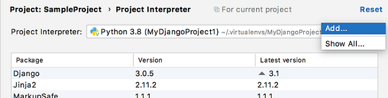
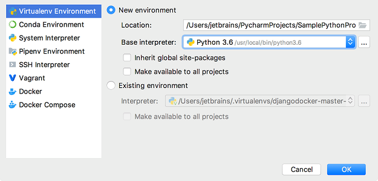
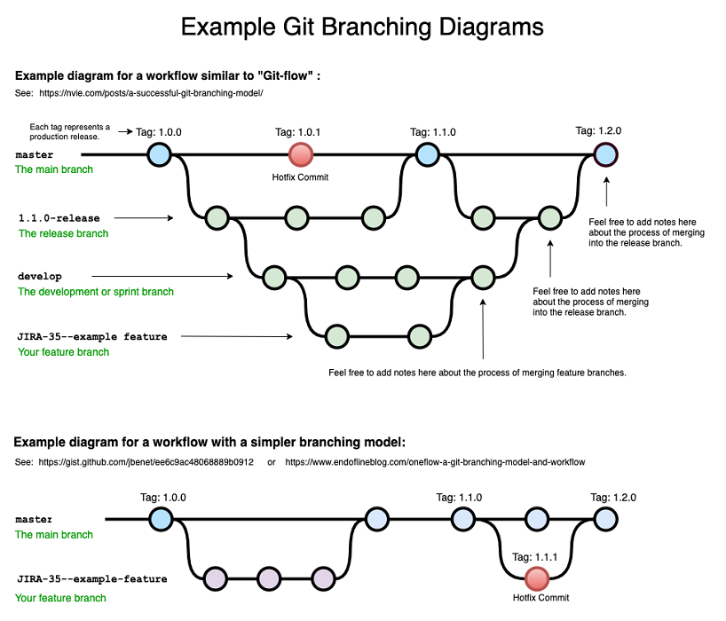
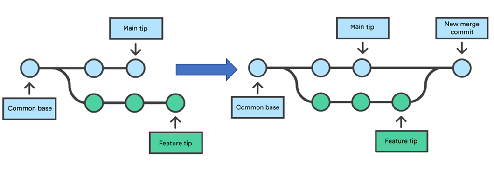
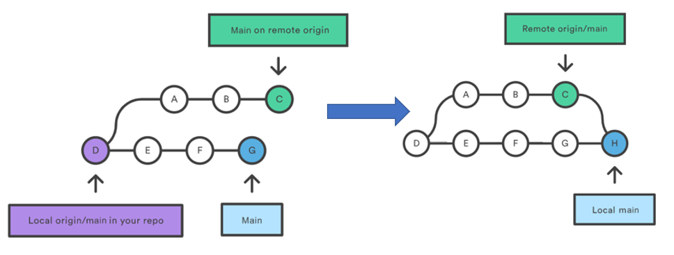
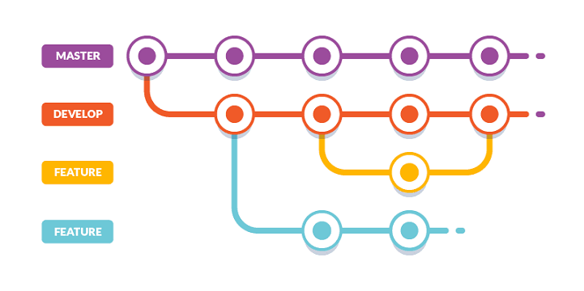
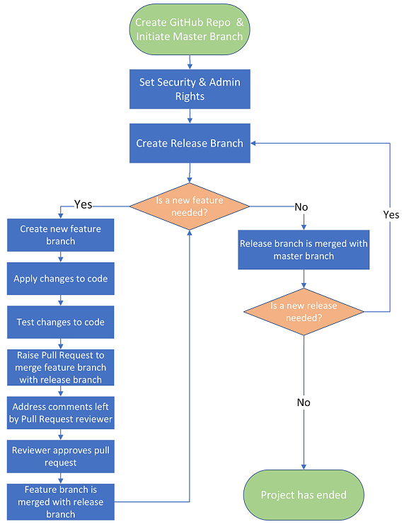
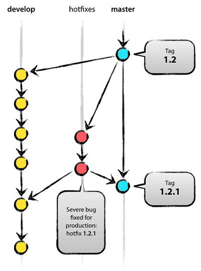

<header>
    <h1 align="center">An Introduction To Python And Git</h1>
    
This document contains an introduction to GitHub and Git along with
    the best practices to follow when working collaboratively
    within GitHub.

    

        Author:
            <a href="mailto:Harry.Edwards@uk.ey.com">Harry Edwards</a>
    

    

    Composed: March 2022
    

</header>

 

 

## Table of Contents

---
- [Setting Up A Python Environment](#setting-up-a-python-environment)
    -  [Requirements](#requirements)
        - [Installing Python](#installing-python)
        - [Installing PyCharm](#installing-pycharm)
        - [Creating a GitHub Account](#creating-a-github-account)
    - [Cloning a Repository](#cloning-a-repository)
    - [Creating a Virtual Environment](#creating-a-virtual-environment)
- [Git-ting Started](#git-ting-started)
    - [Git vs GitHub](#git-vs-github)
        - [A Git](#a-git)
        - [GitHub](#github)
    - [Essential Git Commands](#essential-git-commands)
        - [Git Add](#git-add)
        - [Git Commit](#git-commit)
        - [Git Push](#git-fetch)
        - [Git Fetch](#git-fetch)
        - [Git Branch](#git-branch)
        - [Git Checkout](#git-checkout)
        - [Git Merge](#git-merge)
        - [Git Pull](#git-pull)
- [Best Practices](#best-practices)
    - [Coding Standards](#coding-standards)
    - [Git Development Workflow](#git-development-workflow)
        - [Git Development Workflow Template](#git-development-workflow-template)
        - [Git Development Workflow Flowchart](#git-development-workflow-flowchart)
    - [Branch Management](#branch-management)
        - [Master/Main Branch](#mastermain-branch)
        - [Hotfix Branch](#hotfix-branch)
        - [Development/Release Branch](#developmentrelease-branch)
        - [Feature Branch](#feature-branch)
    - [Creating Pull Requests](#creating-pull-requests)
    - [Reviewing Pull Requests](#reviewing-pull-requests)
    
 

## Setting Up A Python Environment

---

This section of this document outlines the steps required to successfully
set up a Python environment and collaborative code repository on your local machine.

### Requirements

---

There are many different ways to install and develop with Python on your machine/VDI. The items listed
below are the recommended minimum requirements for getting set-up with Python and Git. This list is
not exhaustive and there are alternatives that may better suit your needs.

- Python installed to local machine
- PyCharm (IDE)
- A GitHub account

#### Installing Python

 
For the easiest installation of Python install via <a href="https://www.anaconda.com/products/individual?modal=nucleus"> 
Anaconda</a> and follow the on screen installation wizard.

 
If you would prefer to install the Python executable directly this can be done
    <a href="https://www.python.org/downloads/">
    here</a>.

#### Installing PyCharm

 
PyCharm is a Python IDE (Integrated Development Environment) that combines common developer
tools into a single GUI (Graphical User Interface). Essential features to become familiar with include:

- Text Editor
- Terminal
- Debugger
- TODO List
- Git GUI

To download PyCharm 
<a href="https://www.jetbrains.com/pycharm/download/#section=windows">
follow this link
</a>
and select the community edition appropriate for your system requirements.

#### Creating a GitHub Account

To create a GitHub account 
    <a href="https://www.google.com/url?sa=t&rct=j&q=&esrc=s&source=web&cd=&cad=rja&uact=8&ved=2ahUKEwjG8bmindf2AhXCmFwKHcqmCvsQFnoECAcQAQ&url=https%3A%2F%2Fgithub.com%2Fjoin&usg=AOvVaw0H9TK-nu7JfXaoNeNMgJEk">
    follow this link</a>. Enter your email address, select a username and password; now you
are ready to go!

### Cloning A Repository

---

To begin editing, creating and running code from your team's GitHub repository you will need
to clone the remote (online) repository onto your local machine. This can be done from with in the
PyCharm IDE, in the following steps:

1. From the main menu, select Git | Clone, or, if no project is currently opened,
   click Get from VCS (Version Control System) on the Welcome screen.
2. In the Get from Version Control dialog, specify the URL of the remote repository
   you want to clone.
3. Log in to the selected hosting service, PyCharm will then
   suggest the list of available repositories that you can clone.
4. Click Clone. You will want to create a project based on the sources
   you have cloned, click Yes in the confirmation dialog.
   Git root mapping will be automatically set to the project root directory.

### Creating a Virtual Environment

---

 
Python virtual environments are such that the
Python interpreter, libraries and scripts installed into it are isolated from other Python
Environments.  

The use of a virtual environment for your Python project allows for easy non-conflicting version
control of packages and creation of an accurate and concise requirements.txt file. To set up a
Python virtual environment within your project execute these commands within the PyCharm IDE:

1. Click the Python Interpreter selector and choose "Add Interpreter".

2. In the left-hand pane of the Add Python Interpreter dialog, select Virtualenv Environment.
   Select "New environment".  

3. Specify the location of the new virtual environment in the text field, or click Virtual environment
   location and find location in your file system. Note that the directory where the new virtual environment
   should be located, must be empty!
4. Choose the base interpreter from the list, or click Choose the base interpreter and
   find a Python executable in your file system.
5. Do not select "Inherit global site-packages" or "Make available to all projects".

Now you have created a virtual environment you must download all necessary Python packages. All Python packages
required to run the project are stored in the requirements.txt file which was downloaded when the project was cloned.
To install these packages execute
    "<b>pip install -r requirements.txt</b>"
in the terminal.

 

## Git-ting Started

---

This section of this document aims to inform the user on Git and GitHub terminology,
methodology and use-cases.

### Git vs GitHub

---

You may have already heard the words "Git" and "GitHub", they are frequently used within the coding community.
But what do they actually mean?

To understand the difference between a Git and GitHub we must first understand what we are referring to
when we say "a Git".

#### A Git

Git is a version control system used for tracking changes in computer files. A Git is an instance of this version control
system (think: "dog" - an animal; "a dog" - instance of an animal). Git is used to track changes in the source code;
the distributed version control tool is used for source code management; Git allows multiple
developers to work together; and it supports non-linear development through
use of parallel branches

#### GitHub

GitHub is essentially just an online platform for Gits.
In the same way Twitter has tweets, GitHub has Gits.

GitHub is a for-profit company that offers a cloud-based Git repository hosting service. This means
that software developers can upload there Gits to GitHub repositories where other software developers can access
the source code, update the Git and work collaboratively.
(think: you can take your dog to the dog park to show your friends).

### Essential Git Commands

---

Below we list several Git commands it is essential to become familiar with to successfully
and efficiently utilise Git within your project. It is worth noting all the commands
listed below need not be run from the command line. For beginners with Git it is much
easier to run these commands via the PyCharm Git GUI.

#### Git Add

The 
    <b><i>
    git add
    </i></b>
command adds new or changed files in your working directory to the Git staging area.
These files will be added to the next commit when the
    <b><i>
    git commit
    </i></b>
command is called.

    
#### Git Commit

The 
    <b><i>
    git commit
    </i></b> 
command captures a snapshot of the project's currently staged changes.
Committed snapshots can be thought of as “safe” versions of a project - Git will never change
them unless you explicitly ask it to. We can think of each
    <b><i>
    commit
    </i></b>
as a version history file of the project.

As a general rule of thumb you should commit any changes made about as often as you would save
an Excel file (every 15-20 minutes), this will avoid unnecessary loss of work. Each time
a commit is made it should be accompanied by a
    <b><i>
    message.
    </i></b>
The message should provide a concise description of what work has been done and changes made
up to this point. Short or vague messages are bad practice and unhelpful.

#### Git Push

The 
    <b><i>
    git push 
    </i></b>
command is used to upload local repository content to a remote repository. When a
commit is made, the project's remote repository is not automatically updated with the latest
changes. 
    <b><i>
    Pushing 
    </i></b>
transfers commits from your local repository (your machine) to the remote
repository (stored on GitHub).

#### Git Fetch

 
The 
    <b><i>
    git fetch
    </i></b>
command downloads commits, files, and refs from a remote repository into your local repository.
Fetching is what you do when you want to see what everybody else has been working on. It
transfers the latest project state from the remote repository to your local repository.
    <b><i>
    Git fetch
    </i></b>
is the counterpart of 
    <b><i>
    git push.
    </i></b>

#### Git Branch

In Git, branches are a part of your everyday development process. Git branches are
effectively a pointer to a snapshot of your changes. When you want to add a new feature
or fix a bug - no matter how big or how small - you spawn a new branch to encapsulate your
changes.

The 
    <b><i>
    git branch
    </i></b>
command can be used to create, rename, list or delete branches in the repository.
It's important to understand that branches are just pointers to commits. When you create
a branch, all Git needs to do is create a new pointer, it does not change the repository
in any other way.

#### Git Checkout

The 
    <b><i>
    git checkout
    </i></b>
command lets you navigate between the branches created by
    <b><i>
    git branch.
    </i></b>
Checking out a branch updates the files in the working directory to match the version
stored in that branch, and it tells Git to record all new commits on that branch.
Think of it as a way to select which line of development you’re working on.

    
#### Git Merge

The 
    <b><i>
    git merge
    </i></b>
command will combine multiple sequences of commits into one unified history.
    <b><i>
    Merging 
    </i></b>
is Git's way of putting a forked history back together again.
The git merge command lets you take the independent lines of
development created by git branch and integrate them into a single branch.

How it works:
    <b><i>
    git merge
    </i></b>
in its most frequent use case will combine two branches. In this scenario
    <b><i>
    git merge
    </i></b>
takes two commit pointers (usually branch tips) and finds a common base between them.
Once a common base has been found, Git creates a new "merge commit" that combines changes
of each queued merge commit sequence. This process is represented graphically below.

    
#### Git Pull

The
    <b><i>
    git pull
    </i></b>
command is used to fetch and download content from a remote repository and
update the local repository to match that content. The
    <b><i>
    git pull
    </i></b>
command is 
actually a combination of two other commands,
    <b><i>
    git fetch
    </i></b>
followed by
    <b><i>
    git merge.
    </i></b>
In the first step of the operation
    <b><i>
    git pull
    </i></b>
will execute a
    <b><i>
    git fetch
    </i></b>
to download the latest version of the target branch to the local repository. Once the content
is downloaded,
    <b><i>
    git pull
    </i></b>
will initiate a
    <b><i>
    git merge
    </i></b>
which will combine the pulled branch with the target branch. A new merge commit will be created,
and the non-target branch can be retired. This process is shown graphically below.

 

## Best Practices

---

This section of this document aims to inform the user on Git and GitHub best practices
to follow when working collaboratively. By following these best practices your team will
minimise time spent refactoring code; errors due to human mistake; and duplication of work.

### Coding Standards

---

Each client will likely have there own coding standards that are required before
code can be hosted on their servers. These standards should be requested, circulated
and discussed/understood before development begins.

If there are no required standards or your opinion is that current standards are not
sufficient, the
    <a href="https://google.github.io/styleguide/pyguide.html">
    Google Python Style Guide
    </a>
is considered industry best practice.

### Git Development Workflow

---

A Git development workflow is a recommendation for how to use Git to
accomplish work in a consistent and productive manner. When working collaboratively
with Git, it is important to ensure all team members know how changes
will be (should be) applied. Git was designed with a focus on flexibility,
hence there is no standard Git workflow. However, the Git development workflow outlined below
well suits the needs of most projects.

#### Git Development Workflow Template

The below workflow assumes a team Hierarchy. Senior developers will have
push permissions which allow the developer to merge branches within
the repository. Junior developers will need to raise a pull request to a
senior developer when their code branch is ready to be merged with its
base branch.

 
Bigger projects require control and transparency over what code is released
and when it is released. To ensure the best quality product is released, to
the client, unit and integrations tests are required. These tests have a large
time cost associated and can slow down development and move resources away from
feature development. A Git development workflow invented and described by
Vincent Driessen in 2010 balances the need for quality and efficiency. This workflow
employs two parallel long running branches:

- Master Branch
    - This branch is used for stable releases of code to production/client only.
    - Merges to this branch undergo stringent unit and integration testing. Along with other project specific testing.
- Development/Release Branch
    - This Branch is created from the master each time a new release is required. A release is a collection
    of new features.
    - This branch is the home of all completed and stable features required within the release. Feature branches undergo
    less stringent testing before being merged to the release branch.

Each time a developer begins work on a new feature a feature branch is created from
the release branch. As many feature branches as required can be created in parallel.
When feature is completed and tested the branch is merged back to the release branch and
retired.

#### Git Development Workflow Flowchart

The below flowchart graphically represents the Git development workflow outlined in the previous
sub-section.

Feel free to update the workflow described above to best suit your projects requirements.

### Branch Management

---

When working in a Git Development Workflow it is important to keep a clean branch
hierarchy. If multiple team members are working on the same dependency/code within
different branches this will cause conflicts when it comes to merging branches.
To avoid branch conflicts upon merging it helps to place branches into categories.
Each branch category the has its own terms of use, these terms ensure a clean branch
history within your repository.

#### Master/Main Branch

As discussed in the last section the master branch in the first branch created when
your repository is created. This branch is only used to deploy stable releases of the code
to production.

When a development/release branch is merged to this branch it should have already undergone
stringent testing.

#### Hotfix Branch

Sometimes errors can slip through the gaps, even with the most stringent testing.
Hotfix branches are used to fix code within the master branch, when the fix is needed before
the next release branch can be merged. One hotfix use case would be to fix a bug,only
realised after release in the production code.

Hotfix branches are created from the master branch and must merge back into both the
master and live development branches. This allows developers to continue work on upcoming
features, while one developer prepares a quick production fix.

#### Development/Release Branch

Each time a new version of code is released a development branch has been merged with
the master branch. Versioning is often formatted as follows; development branch 1 is
merged to master, code is at version 1.1.0; hotfix to solve some unrealised issue, code
is at version 1.1.1; development branch 2 is merged to master, code is at version 1.2.0.

Development branches are created from the master branch and transport the master branch between releases. Each release will have
an agreed number of new features, these features are combined in the development branch which
runs parallel to the master branch. The development branch houses all complete and stable
features

When a feature branch is merged with the development branch it should undergo some testing to ensure
the required functionality is operational. However, this testing is not as stringent as the testing before
development branches are merged with the master branch.

#### Feature Branch

 
Each time a developer begins work on a new feature a feature branch is created from
the release branch. Feature branches will make up the majority of branches in the repository.
Feature branches will contain new code, code improvements and experiments. Every idea (feature) should be
born (created) in a feature branch. 

Multiple parallel feature branches can be live during a one project snapshot.
This is the most effective way for a team to develop features within a repository.
But, there is a risk associated when running multiple feature branches at once.
It is important to ensure feature codes do not overlap, this is the role of the
project/repository/team manager. Preventing the same code from being altered on different
branches during the same snapshot, will avoid merge conflicts when development and
testing is complete.

If more than one developers are working on the same branch they must coordinate regularly and clearly
set set out work allocations.

### Creating Pull Requests

---

Avoiding a frustrating back-and-forth between developer and reviewer due to
declined pull requests, edits and more declined pull requests, is key to
the smooth running of any project. To prevent pull requests being declined
by your assigned reviewer(s) below is a helpful checklist to go through
before submitting a pull request.

- Pick the correct target branch
    - Ensure you are requesting to merge with the appropriate target branch.
    - For example do not try to merge your development branch directly to the master
    branch
- Check for **TODO** or **NOTE** notations in your code, this will likely point you to overlooked
incomplete code
- Review _print_ statements in code you are submitting
    - Ask yourself: "are these _print_ statements needed, or were they being used to debug
    now fixed errors?"
- Use a plugin which highlights empty line or trailing space mistakes
    - Google: "remove trailing spaces in <insert your favorite editor here>"
- Re-read your code with coding standards required by the project in mind
- Write a good pull request message, this will help the reviewer and prevent
the cumbersome back-and-forths we are trying to avoid
    - A pull request message should guide your reviewer through
      the context of the changes made. 
    - Do your best to explain your rational for each change
    - Use screenshots to highlight important changes
    - If you still need inspiration, try this [template](https://github.com/sourcelevel/guidelines/blob/main/.github/pull_request_template.md)

Making draft pull requests as you commit and develop code can also help in the
creation of successful pull requests. make a small checklist to make explicit how
you’ve advanced in that change. It provides a clear idea of “next steps” for you and your peers.

### Reviewing Pull Requests

---

After a pull request is opened, anyone with read access can review and
comment on the changes it proposes. You can also suggest specific changes
to lines of code, which the author can apply directly from the pull request.

Reviews allow for discussion of proposed changes and help ensure that
the changes meet the repository's contributing guidelines and other
quality standards. You can define which individuals or teams own certain
types or areas of code in a CODEOWNERS file. When a pull request modifies
code that has a defined owner, that individual or team will automatically
be requested as a reviewer.

Reviewer can review changes in a pull request one file at a time.
While reviewing the files in a pull request, individual
comments on specific changes can be left. After a reviewer finishes reviewing each file,
it can be marked as viewed. This collapses the file, helping
identify the files still awaiting review. A progress bar in the pull
request header shows the number of files viewed. After reviewing
as many files as the reviewer sees fit, the pull request can be approved or
additional changes can be requested by submitting the review with a summary comment.

 

<footer>
    

    Thank you for reading this document. If you have any recommended improvements,
    comments or would like to circulate outside the EY UK Credit Risk Team, please contact
            <a href="mailto:Harry.Edwards@uk.ey.com">Harry Edwards</a>
    (Harry.Edwards@uk.ey.com).
    

    

        <i>
        &copy; Property of EY
        </i>
    

</footer>